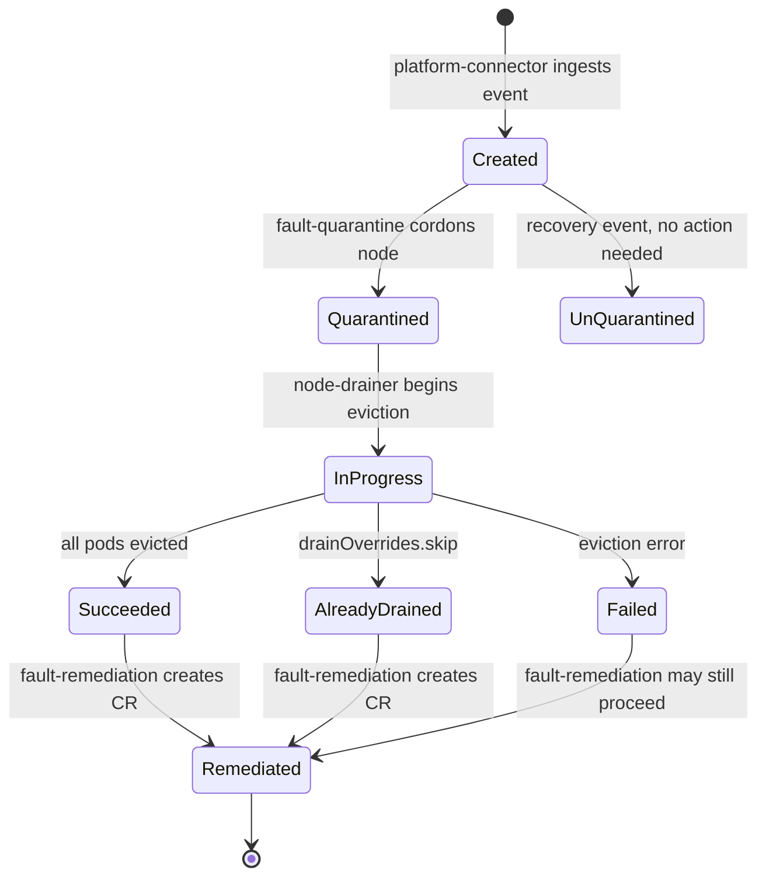

# HealthEvent Data Model Reference

This document is the authoritative reference for the `HealthEvent` data model — the
fundamental unit of data that flows through NVSentinel. Every fault detected by any
health monitor is represented as a `HealthEvent`, and every downstream module
(quarantine, drain, remediation, export) consumes and enriches this structure.

> **Audience**: Developers building custom health monitors, writing CEL quarantine
> rules, integrating external systems via the event exporter, or debugging the
> fault-remediation pipeline.
>
> **Document type**: Reference. Expected lifetime: same as the proto schema it
> describes. This document must be updated in the same PR that modifies
> `data-models/protobufs/health_event.proto` or
> `data-models/protobufs/external_remediation.proto`. If you change a field,
> enum value, or status transition in those files, update the corresponding
> section here before merging.

## Table of Contents

- [Where the Model Lives](#where-the-model-lives)
- [Core Message: HealthEvent](#core-message-healthevent)
- [Field Reference](#field-reference)
- [RecommendedAction Enum](#recommendedaction-enum)
- [ProcessingStrategy Enum](#processingstrategy-enum)
- [BehaviourOverrides](#behaviouroverrides)
- [Entity (Impacted Resources)](#entity-impacted-resources)
- [Storage Wrapper: HealthEventWithStatus](#storage-wrapper-healtheventwithstatus)
- [HealthEventStatus Lifecycle](#healtheventstatus-lifecycle)
- [CRD Projection: HealthEventResource](#crd-projection-healtheventresource)
- [External Remediation Request](#external-remediation-request)
- [Deduplication](#deduplication)
- [Tracing Correlation](#tracing-correlation)
- [Examples](#examples)

---

## Where the Model Lives

| Artifact | Path | Purpose |
|----------|------|---------|
| Protobuf definition | `data-models/protobufs/health_event.proto` | Wire format and CRD generation source |
| Generated Go types | `data-models/pkg/protos/health_event.pb.go` | Import as `github.com/nvidia/nvsentinel/data-models/pkg/protos` |
| Go extensions | `data-models/pkg/model/health_event_extentions.go` | Helper constants and `GetEffectiveActionName()` |
| gRPC service | `data-models/protobufs/health_event.proto` → `PlatformConnector` service | Ingestion RPC used by all health monitors |
| External remediation | `data-models/protobufs/external_remediation.proto` | CRD for handoff to external repair systems |

---

## Core Message: HealthEvent

```protobuf
message HealthEvent {
  uint32 version = 1;
  string agent = 2;
  string componentClass = 3;
  string checkName = 4;
  bool isFatal = 5;
  bool isHealthy = 6;
  string message = 7;
  RecommendedAction recommendedAction = 8;
  repeated string errorCode = 9;
  repeated Entity entitiesImpacted = 10;
  map<string, string> metadata = 11;
  google.protobuf.Timestamp generatedTimestamp = 12;
  string nodeName = 13;
  BehaviourOverrides quarantineOverrides = 14;
  BehaviourOverrides drainOverrides = 15;
  ProcessingStrategy processingStrategy = 16;
  string id = 17;
  string customRecommendedAction = 18;
}
```

---

## Field Reference

If you are building a custom health monitor, the table below shows what happens
when a field is omitted or left at its zero value. See
[Writing a Health Monitor](./tutorials/writing-a-health-monitor.md) for the
end-to-end walkthrough.

| # | Field | Type | Description | If omitted / zero value |
|---|-------|------|-------------|------------------------|
| 1 | `version` | `uint32` | Protocol version. Currently `1`. | Ingestion may reject the event. Always set to `1`. |
| 2 | `agent` | `string` | Name of the health monitor that produced the event (e.g. `"gpu-health-monitor"`, `"syslog-health-monitor"`, `"csp-health-monitor"`). Used in metrics labels and log correlation. | Metrics and logs lose source attribution. Event is still accepted. |
| 3 | `componentClass` | `string` | Category of the affected component. Common values: `"GPU"`, `"gce_instance"`, `"EC2"`, `"Software"`, `"NIC"`. Consumed by CEL quarantine rules for filtering. | CEL rules that filter on `componentClass` will not match. Quarantine may not trigger. |
| 4 | `checkName` | `string` | Identifier of the specific check that fired (e.g. `"xid-check"`, `"sxid-check"`, `"CSPMaintenance"`). The deduplication transformer uses this as its suppression key. | Deduplication cannot suppress repeats. Every poll produces a new actionable event. |
| 5 | `isFatal` | `bool` | Whether the fault is considered fatal (hardware replacement likely needed). Quarantine rules typically require `isFatal == true` to cordon a node. | Defaults to `false`. Most quarantine rules will not match — the node stays schedulable. |
| 6 | `isHealthy` | `bool` | `false` for fault events, `true` for recovery events. A recovery event can un-quarantine a node if all active faults have cleared. | Defaults to `false` (treated as a fault). A recovery monitor **must** set this to `true` or it will re-quarantine instead of clearing. |
| 7 | `message` | `string` | Human-readable description of the fault. Surfaced in Kubernetes node conditions and exported CloudEvents. | Node condition shows an empty message. Operators see the fault but not what it is. |
| 8 | `recommendedAction` | `RecommendedAction` | Enum directing what remediation should occur. See [RecommendedAction Enum](#recommendedaction-enum). | Defaults to `NONE`. Event is stored but no remediation CR is created. |
| 9 | `errorCode` | `repeated string` | Machine-readable error identifiers (e.g. `["XID_48", "XID_79"]`). Used in CEL rules and alerting. | CEL rules matching on `errorCode` will not fire. Alerting integrations lose granularity. |
| 10 | `entitiesImpacted` | `repeated Entity` | Specific hardware entities affected. See [Entity](#entity-impacted-resources). | GPU Reset cannot target a specific GPU — falls back to node-level action or skips. |
| 11 | `metadata` | `map<string, string>` | Arbitrary key-value pairs. Monitors attach diagnostic context (driver version, PCI address, XID details). Propagated to CloudEvents export. | No diagnostic context in exported events. Debugging requires correlating with monitor logs. |
| 12 | `generatedTimestamp` | `Timestamp` | When the monitor detected the fault. Used for deduplication windows and metric duration calculations. | Dedup window anchoring and remediation-duration metrics become inaccurate. |
| 13 | `nodeName` | `string` | Kubernetes node name where the fault was detected. The primary routing key for all downstream modules. | **Required.** Platform connector rejects events without a node name. |
| 14 | `quarantineOverrides` | `BehaviourOverrides` | Per-event override for quarantine behavior. See [BehaviourOverrides](#behaviouroverrides). | No override — CEL rules evaluate normally. |
| 15 | `drainOverrides` | `BehaviourOverrides` | Per-event override for drain behavior. See [BehaviourOverrides](#behaviouroverrides). | No override — per-namespace eviction strategies apply normally. |
| 16 | `processingStrategy` | `ProcessingStrategy` | Controls whether downstream modules may modify cluster state. See [ProcessingStrategy Enum](#processingstrategy-enum). | `UNSPECIFIED` is normalized to `EXECUTE_REMEDIATION` at ingestion. Full remediation pipeline runs. |
| 17 | `id` | `string` | Unique event identifier. Assigned by the platform connector on ingestion if not set by the monitor. | Platform connector generates a UUID. No action needed from the monitor. |
| 18 | `customRecommendedAction` | `string` | Free-form action name when `recommendedAction == CUSTOM`. Must be non-empty (validated at ingestion). Maps to a Helm-configured remediation action. | **Rejected at ingestion** if `recommendedAction == CUSTOM` and this field is empty. |

---

## RecommendedAction Enum

Directs the fault-remediation module on what repair action to trigger.

| Value | Numeric | Meaning | Typical Remediation |
|-------|---------|---------|---------------------|
| `NONE` | 0 | No remediation action recommended | No repair CR created. Storage and cluster mutations (quarantine, drain) remain governed by `processingStrategy`. |
| `COMPONENT_RESET` | 2 | Reset a specific component (GPU, NIC) | GPU Reset CRD targeting `entitiesImpacted` |
| `CONTACT_SUPPORT` | 5 | Hardware likely needs RMA | Alert / ticket creation |
| `RUN_FIELDDIAG` | 6 | Run field diagnostics | Diagnostic job |
| `RESTART_VM` | 15 | Restart virtual machine | CSP reboot via janitor-provider |
| `RESTART_BM` | 24 | Reboot bare-metal node | CSP reboot or generic Job-based reboot |
| `REPLACE_VM` | 25 | Terminate and replace VM | CSP terminate via janitor-provider |
| `RUN_DCGMEUD` | 26 | Run DCGM End-User Diagnostics | Diagnostic pod |
| `CUSTOM` | 27 | User-defined action | Resolved via `customRecommendedAction` → Helm `maintenance.actions` map |
| `UNKNOWN` | 99 | Unrecognized action | Logged and skipped |

**Routing logic** (in `fault-remediation`):

```go
// data-models/pkg/model/health_event_extentions.go
func GetEffectiveActionName(he *protos.HealthEvent) string {
    if he.RecommendedAction == protos.RecommendedAction_CUSTOM {
        return he.CustomRecommendedAction
    }
    return he.RecommendedAction.String()
}
```

The effective action name is looked up in the Helm-configured `maintenance.actions`
map to find the CRD template, API group, kind, and completion condition to create.

---

## ProcessingStrategy Enum

Controls whether downstream modules (fault-quarantine, node-drainer,
fault-remediation) may modify cluster state in response to this event.

| Value | Numeric | Behavior |
|-------|---------|----------|
| `UNSPECIFIED` | 0 | **Normalized to `EXECUTE_REMEDIATION`** by the platform connector at ingestion. Custom monitors that omit this field get full remediation. |
| `EXECUTE_REMEDIATION` | 1 | Normal behavior. All downstream modules process the event and may cordon, drain, and remediate. |
| `STORE_ONLY` | 2 | Observability only. Event is persisted and exported but **no module modifies cluster resources**. |
| `STORE_AND_ANALYSE` | 3 | Event is persisted, exported, and available to the health-events-analyzer, but **no direct cluster modifications** (no cordon/drain/remediate). |

**Where strategy is enforced**:

- **Platform connector** normalizes `UNSPECIFIED` → `EXECUTE_REMEDIATION` at ingestion.
- **Deduplication transformer** downgrades repeated unhealthy events to `STORE_AND_ANALYSE` within a suppression window (see [Deduplication](#deduplication)).
- **Fault-quarantine** skips events where `processingStrategy != EXECUTE_REMEDIATION`.
- **Health-events-analyzer** queries for `STORE_AND_ANALYSE` events specifically.

---

## BehaviourOverrides

```protobuf
message BehaviourOverrides {
  bool force = 1;
  bool skip = 2;
}
```

Per-event overrides that let a health monitor bypass default pipeline behavior.

### `quarantineOverrides`

| Field | Effect |
|-------|--------|
| `force = true` | Quarantine the node regardless of CEL rule evaluation. |
| `skip = true` | Do not quarantine even if rules would normally match. |

### `drainOverrides`

| Field | Effect |
|-------|--------|
| `force = true` | Force immediate eviction for **all** namespaces, ignoring per-namespace eviction strategies (allow-completion timeouts are bypassed). |
| `skip = true` | Skip drain entirely. The event's `UserPodsEvictionStatus` is marked `AlreadyDrained` so fault-remediation proceeds immediately. |

> **Use case**: Debug/test events (e.g. fault-injection demos) set `drainOverrides.skip = true`
> to exercise the remediation pipeline without waiting for pod eviction.

---

## Entity (Impacted Resources)

```protobuf
message Entity {
  string entityType = 1;
  string entityValue = 2;
}
```

Identifies specific hardware entities affected by the fault.

| `entityType` | `entityValue` example | Used by |
|--------------|----------------------|---------|
| `"GPU"` | `"0"`, `"GPU-a1b2c3d4-..."` | GPU Reset CRD (targets specific GPU UUID) |
| `"PCI"` | `"0000:17:00.0"` | Tracing span attributes, diagnostics |
| `"NIC"` | `"mlx5_0"` | NIC health correlation |

The `entitiesImpacted` array is propagated to:

- **Tracing**: each entity becomes a span attribute `health_event.entities_impacted.<type>`.
- **Event exporter**: serialized into the CloudEvents payload.
- **GPU Reset**: the janitor uses GPU UUIDs from entities to target the reset CRD.

---

## Storage Wrapper: HealthEventWithStatus

Events are stored in MongoDB (or PostgreSQL) wrapped in a status envelope:

```go
// data-models/pkg/model/health_event_extentions.go
type HealthEventWithStatus struct {
    CreatedAt         time.Time                 `bson:"createdAt"`
    HealthEvent       *protos.HealthEvent       `bson:"healthevent,omitempty"`
    HealthEventStatus *protos.HealthEventStatus `bson:"healtheventstatus"`
}
```

The `HealthEvent` portion is **immutable after ingestion** (except for dedup
strategy downgrade). The `HealthEventStatus` portion is **progressively enriched**
by each downstream module as it processes the event.

---

## HealthEventStatus Lifecycle

```protobuf
message HealthEventStatus {
  string nodeQuarantined = 1;
  google.protobuf.Timestamp quarantineFinishTimestamp = 2;
  OperationStatus userPodsEvictionStatus = 3;
  google.protobuf.Timestamp drainFinishTimestamp = 4;
  google.protobuf.BoolValue faultRemediated = 5;
  google.protobuf.Timestamp lastRemediationTimestamp = 6;
  map<string, string> spanIds = 7;
}
```

Each field is written by a specific module at a specific pipeline stage:

| Field | Written by | Values / Meaning |
|-------|-----------|------------------|
| `nodeQuarantined` | **fault-quarantine** | `"Quarantined"`, `"UnQuarantined"`, `"AlreadyQuarantined"`, `"Cancelled"` |
| `quarantineFinishTimestamp` | **fault-quarantine** | When quarantine processing completed |
| `userPodsEvictionStatus` | **node-drainer** | `OperationStatus{status, message}` — see below |
| `drainFinishTimestamp` | **node-drainer** | When drain processing completed |
| `faultRemediated` | **fault-remediation** | `BoolValue` — `nil` (absent) = not yet processed; `true` = repair CR created and confirmed; `false` = repair failed or skipped |
| `lastRemediationTimestamp` | **fault-remediation** | When the remediation CR was last created |
| `spanIds` | **all modules** | Distributed tracing span IDs per service (e.g. `{"platform-connector": "abc123", "fault-quarantine": "def456"}`) |

### OperationStatus values (`userPodsEvictionStatus.status`)

| Status | Meaning |
|--------|---------|
| `NotStarted` | Drain has not begun |
| `InProgress` | Pods are being evicted |
| `Succeeded` | All user pods evicted successfully |
| `Failed` | Eviction encountered an error |
| `AlreadyDrained` | Drain was skipped (via `drainOverrides.skip` or prior completion) |

### Status progression diagram



---

## CRD Projection: HealthEventResource

For Kubernetes-native storage (experimental), the HealthEvent maps to a CRD:

```protobuf
message HealthEventResource {
  option (protoc_gen_crd.k8s_crd) = {
    api_group: "healthevents.dgxc.nvidia.com",
    kind: "HealthEventResource",
    plural: "healtheventresources",
    singular: "healtheventresource",
    categories: ["nvidia", "gpu"]
  };
  HealthEvent spec = 1;
  HealthEventStatus status = 2;
}
```

The `spec` field holds the immutable `HealthEvent`; the `status` field holds the
progressively-enriched `HealthEventStatus`. This mirrors the standard Kubernetes
spec/status convention.

---

## External Remediation Request

When `recommendedAction == CUSTOM` and the configured action produces an
`ExternalRemediationRequest` (ExtRR), the full `HealthEvent` is embedded in the
CRD spec:

```protobuf
message ExternalRemediationRequestSpec {
  HealthEvent healthEvent = 1;
}
```

The ExtRR is cluster-scoped (like RebootNode, TerminateNode, GPUReset CRDs) and
carries status conditions for coordination with external repair systems:

| Condition Type | Set by | Meaning |
|---------------|--------|---------|
| `NVSentinelOwnershipReleased` | ExtRR reconciler | NVSentinel has released the node (taint applied, ready for external work) |
| `ExternalRemediationComplete` | External system | External repair is done; NVSentinel can re-admit the node |

See [ADR-040](./designs/040-external-remediation-request.md) for the full design.

---

## Deduplication

The platform connector runs a **Deduplicator** transformer in its ingestion
pipeline. Within a configurable suppression window, repeated events with the same
composite key are downgraded. The dedup key consists of:

- `nodeName`
- `checkName`
- `entitiesImpacted` (canonicalized order)
- `errorCode` (sorted)
- `processingStrategy`
- `isHealthy`

Duplicate unhealthy events are downgraded:

```
processingStrategy → STORE_AND_ANALYSE
```

This prevents a flapping monitor from triggering repeated quarantine/drain/remediation
cycles. The event is still persisted, exported, and available to the
health-events-analyzer, but no cluster state changes occur (no cordon, drain, or
remediation CR creation).

Configuration: see [Platform Connectors configuration](./configuration/platform-connectors.md).

---

## Tracing Correlation

Each module that processes an event writes its span ID into
`HealthEventStatus.spanIds[serviceName]`. This enables end-to-end trace correlation:

```
platform-connector → fault-quarantine → node-drainer → fault-remediation
```

The span ID written to the datastore becomes the **parent span** for the next
module's processing, creating a causal chain across independent services that
communicate only through MongoDB change streams.

See [Distributed Tracing](./tracing.md) for setup and querying.

---

## Examples

### GPU XID fault (fatal, triggers reboot)

```json
{
  "version": 1,
  "agent": "syslog-health-monitor",
  "componentClass": "GPU",
  "checkName": "xid-check",
  "isFatal": true,
  "isHealthy": false,
  "message": "XID 79: GPU has fallen off the bus",
  "recommendedAction": "RESTART_BM",
  "errorCode": ["XID_79"],
  "entitiesImpacted": [
    {"entityType": "GPU", "entityValue": "GPU-a1b2c3d4-e5f6-a7b8-c9d0-e1f2a3b4c5d6"},
    {"entityType": "PCI", "entityValue": "0000:17:00.0"}
  ],
  "metadata": {"driverVersion": "570.86.15"},
  "nodeName": "gpu-node-42",
  "processingStrategy": "EXECUTE_REMEDIATION"
}
```

### Recovery event (un-quarantine)

```json
{
  "version": 1,
  "agent": "gpu-health-monitor",
  "componentClass": "GPU",
  "checkName": "dcgm-health-check",
  "isFatal": false,
  "isHealthy": true,
  "message": "All GPU health checks passing",
  "recommendedAction": "NONE",
  "nodeName": "gpu-node-42",
  "processingStrategy": "EXECUTE_REMEDIATION"
}
```

### Custom remediation with drain skip

```json
{
  "version": 1,
  "agent": "custom-monitor",
  "componentClass": "Software",
  "checkName": "memory-pressure",
  "isFatal": true,
  "isHealthy": false,
  "message": "Uncorrectable memory pressure detected",
  "recommendedAction": "CUSTOM",
  "customRecommendedAction": "slack-notify-ops",
  "drainOverrides": {"skip": true},
  "nodeName": "worker-7",
  "processingStrategy": "EXECUTE_REMEDIATION"
}
```

---

## Related Documentation

- [Data Flow](./DATA_FLOW.md) — end-to-end sequence diagrams
- [Platform Connectors](./platform-connectors.md) — ingestion and validation
- [Fault Quarantine](./fault-quarantine.md) — CEL rule evaluation
- [Node Drainer](./node-drainer.md) — eviction strategies
- [Fault Remediation](./fault-remediation.md) — CRD creation and action routing
- [Event Exporter](./event-exporter.md) — CloudEvents transformation
- [ADR-021: Health Event Property Overrides](./designs/021-health-event-property-overrides.md)
- [ADR-025: Processing Strategy](./designs/025-processing-strategy-for-health-checks.md)
- [ADR-039: Health Event Deduplication](./designs/039-health-event-deduplication.md)
